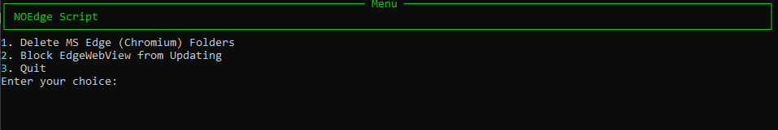

# NOEdge

## Features

- **Delete MSEDGE:** 

- **Stop WebView from Updating:** 

## Getting Started

### Prerequisites

- Python 3
- pip install -r requirements.txt
  or
- Download exe from [releases](https://github.com/wuku0/NOedge/releases)

